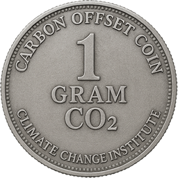

# 🌍 Carbon Credit Coin (CCC)



**Carbon Credit Coin (CCC)** is a climate-positive Ethereum-based token developed by the [Climate Change Institute](https://climatechangeinstitute.net). Each CCC represents **1 gram of verified CO₂ offset** from UN-certified projects.

---

## 🔥 Token Overview

- **Name**: Carbon Credit Coin  
- **Symbol**: CCC  
- **Type**: ERC-20  
- **Blockchain**: Ethereum (Goerli Testnet currently)  
- **Supply**: 1,000,000 CCC = 1 tonne CO₂  
- **Current Value**: $10/tonne ($0.01/coin)  
- **Projected**: $50/tonne by 2030  

---

## 🌱 What Can You Do with CCC?

- ✅ Offset your carbon footprint  
- 🔄 Trade or hold as a carbon-backed asset  
- ♻️ Redeem offsets backed by:
  - UN Clean Development Mechanism (CDM)
  - Verra VCS
  - United Nations UCR

---

## 🛠 Deployment & Setup

### 📦 Prerequisites

- Ubuntu 22.04 or 24.04 LTS
- Node.js ≥ 18
- NPM
- Git
- Alchemy API key
- Ethereum wallet private key

### 🚀 Quickstart

```bash
# Clone the repo
git clone https://github.com/climchg/carbon-credit-coin.git
cd carbon-credit-coin

# Install dependencies
npm install

# Create a .env file with:
# PRIVATE_KEY=your_wallet_private_key
# ALCHEMY_API_KEY=your_alchemy_api_key

# Deploy to Goerli testnet
npx hardhat run scripts/deploy.js --network goerli
